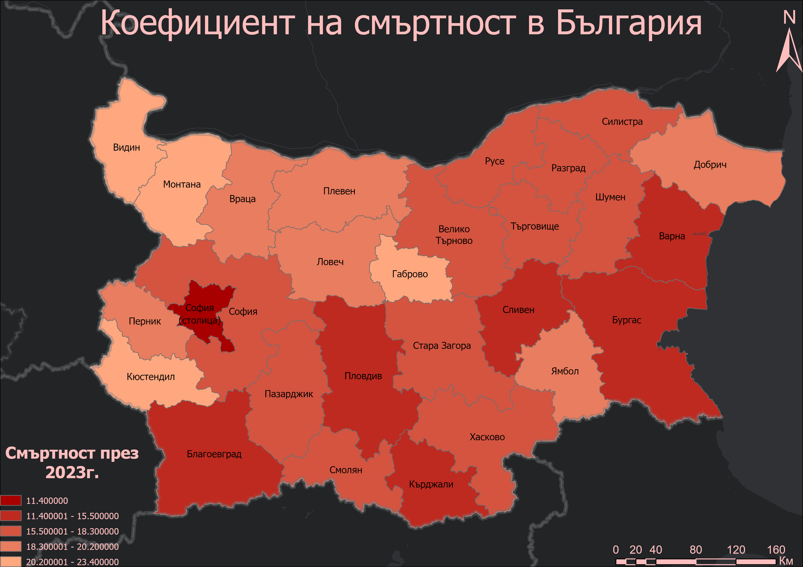
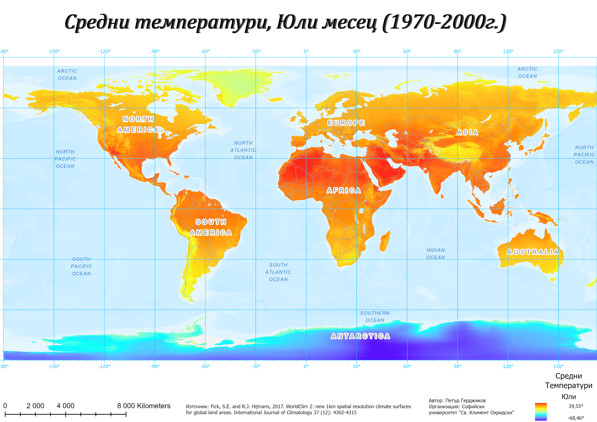
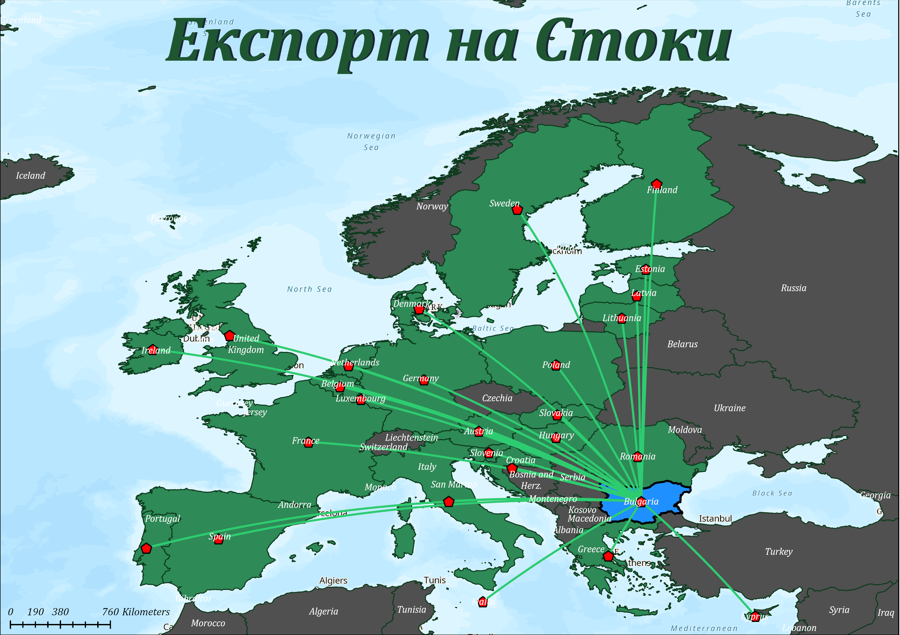
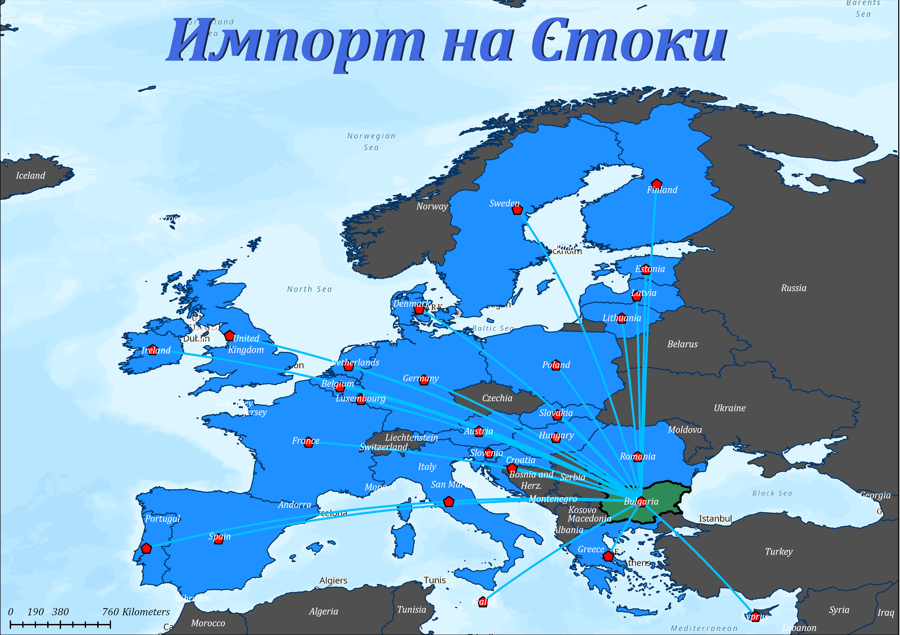

# Final Project Graphic Design

## Exercise 1 Map
### Population by districts, Bulgaria 2021

## Exercise 2 Map
### Classifying territories in Central Balkan

<!-- Снимки - композиция -->

## Exercise 3 Map 1
### Parts of forrest territories in Burgas District

## Exercise 3 Map 2
### Average income by district, Bulgaria 2020

## Exercise 3 Map 3
### Average income by district (Bar chart), Bulgaria 2020

<!-- Задание - композиция с данни от OSM -->

## Exercise 4
### Population Data, Sofia, Bulgaria

<!-- Карти - Етна -->

## Exercise 5 Map 1
### Biosphere Parks - Thematic map 1

## Exercise 5 Map 2
### Biosphere Parks - Thematic map 1

## Exercise Three Maps Three Scenarios Map 1
### Coefficient of death, Bulgaria, Optimistic map

## Exercise Three Maps Three Scenarios Map 2
### Coefficient of death, Bulgaria, Pessimistic map

## Exercise Three Maps Three Scenarios Map 3
### Coefficient of death, Bulgaria, Realistic map

## Visualization and cartographic layout January Map
### Average temperatures for January (1970-2000)

## Visualization and cartographic layout July Map
### Average temperatures for July (1970-2000)

## Exercise 6 Map
### Visualizing terrain, Rila Mountain

## Exercise 7 Map
### Map of visible territories from Mt. Musala

## Exercise Complementary Map
### Attack of wolves on cattle, Izvorsko village

## Exercise 8 Export Map
### Export of goods

## Exercise 8 Import Map
### Import of goods

<!-- Viewpoints project -->