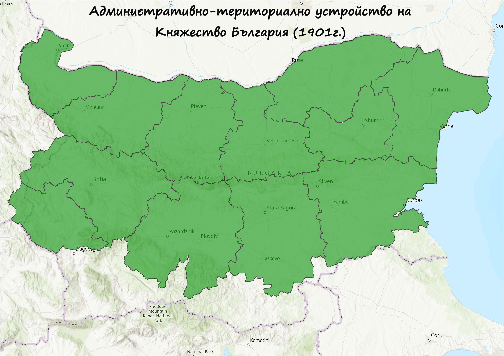
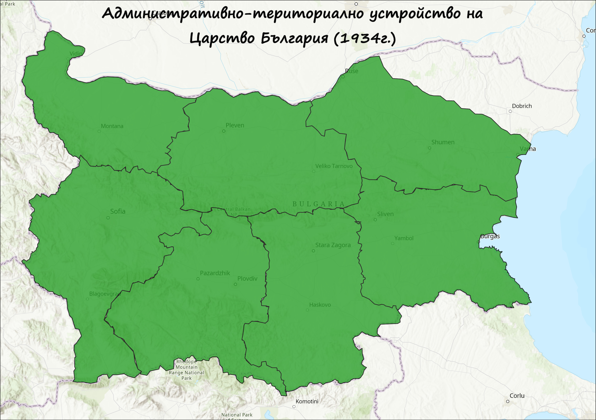
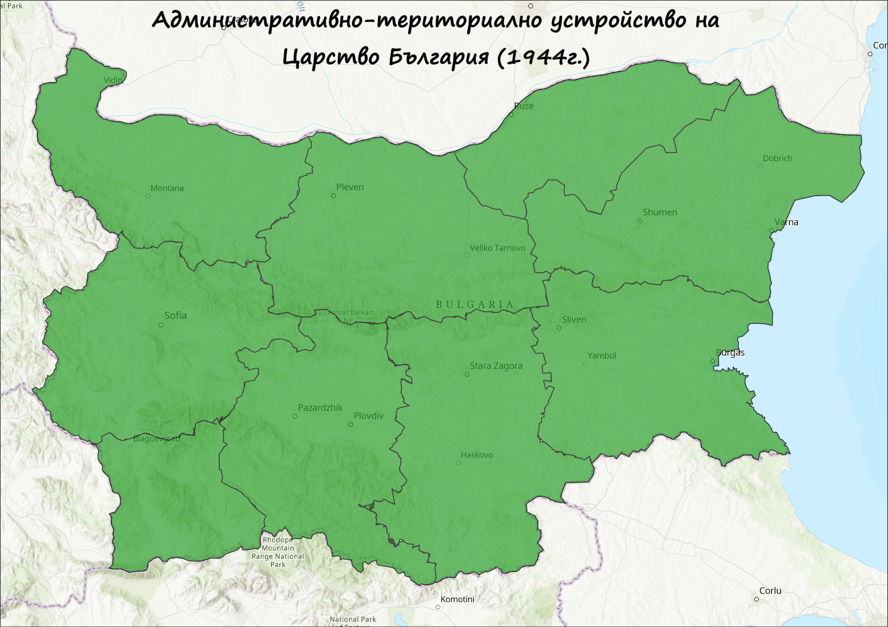
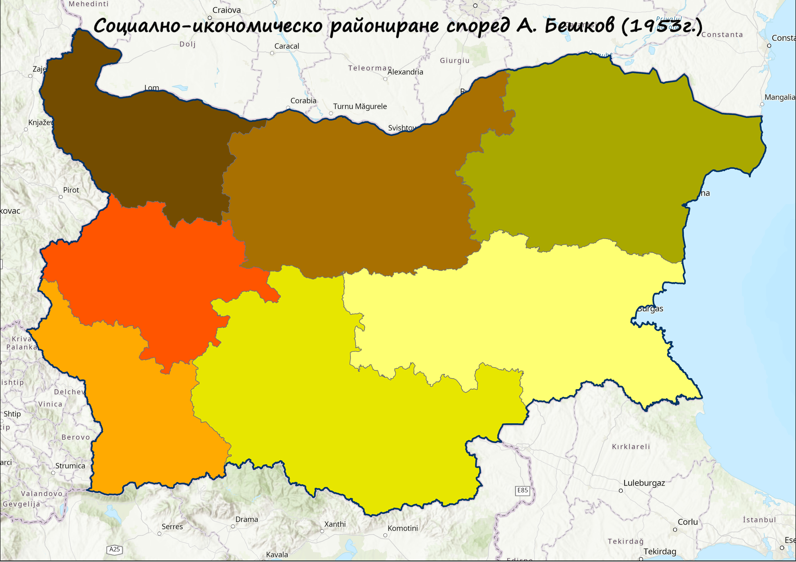
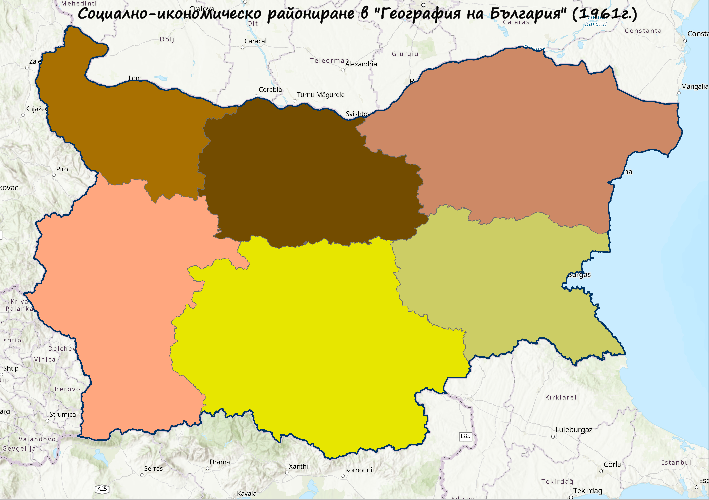
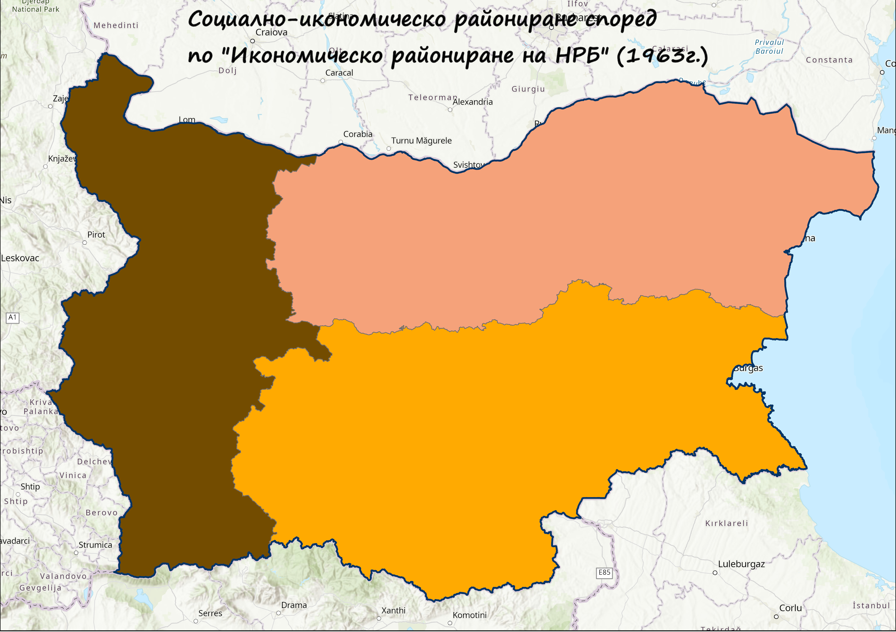
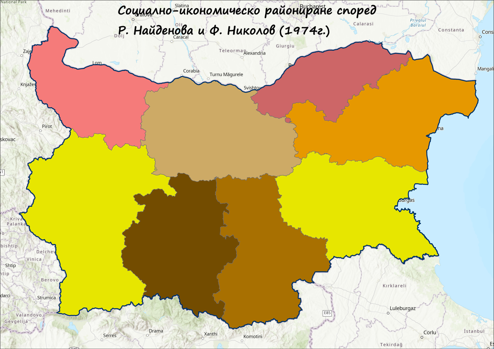
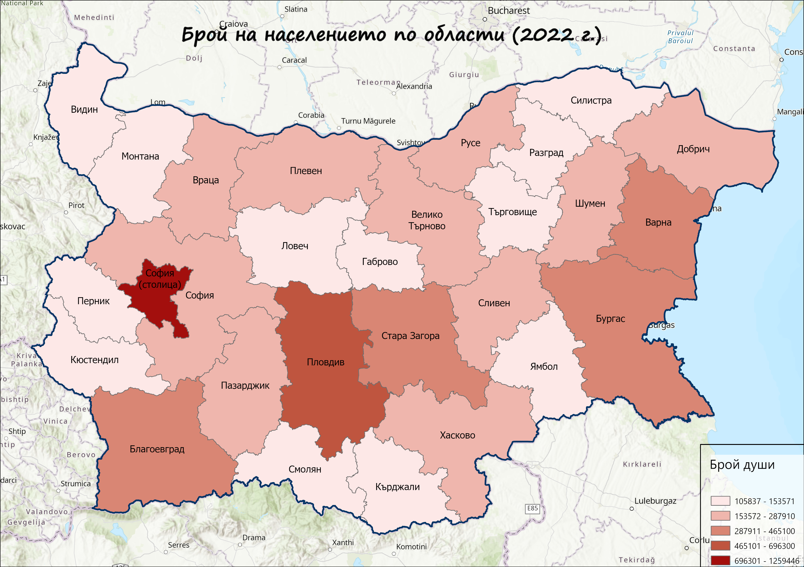

# 🗺️ Карти, разработени през семестъра по 📚 Социално-икономическа география на България

## Исторически карти

🏛️ Цариградска конференция – 1876 г.
📌 Предложение за автономия на българските земи, изготвено от Великите сили след Априлското въстание. Планът не е приет, но поставя началото на международното внимание към българския въпрос.

🗺️ Санстефанска България – 1878 г.
📌 Подписан след Руско-турската война, договорът очертава "Голяма България", включваща почти всички български етнически територии. Въпреки това остава нереализирана поради недоволството на Великите сили.

🧭 Берлински конгрес – 1878 г.
📌 Преразглеждане на Санстефанския договор – България е разделена на Княжество България, Източна Румелия и Македония, която остава в рамките на Османската империя.

🤝 Съединение – 1885 г.
📌 Източна Румелия се обединява с Княжество България – едностранен акт от българска страна, признат по-късно от Великите сили.

⚔️ България след Балканската война – 1912 г.
📌 След успешното участие в Балканската война, България разширява територията си, включително Тракия и части от Македония.

📉 България след Букурещкия и Цариградския договор – 1913 г.
📌 След Междусъюзническата война България губи значителни територии – главно в Македония, отстъпени на Сърбия, Гърция и Румъния.

⚖️  – 1919 г.
📌 След Първата световна война България претърпява тежки териториални загуби и наложени репарации. Това бележи нов етап на икономически и политически упадък.

🕊️ България след Парижкия мирен договор – 1947 г.
📌 След края на Втората световна война, България запазва границите си от преди войната, но влиза в съветската сфера на влияние и става Народна република.

## 🧭 Административно-териториални устройствени карти (АТУ)
📍 Проследяване на етапите на териториално-административната реформа в България през различни исторически периоди. Картите отразяват промените в броя и структурата на административните единици – околии, окръзи, области и региони.

🗓️ АТУ – 1887 г.
📌 Първи административен модел на Княжество България след Освобождението.

🗓️ АТУ – 1901 г.
📌 Малки изменения след Съединението, фокус върху консолидирането на управлението.

🗓️ АТУ – 1934 г.
📌 Провежда се голяма реформа – създават се 7 области, централизира се управлението.

🗓️ АТУ – 1944 г.
📌 Периодът отбелязва началото на политически промени и нови структури на управление.

🗓️ АТУ – 1946 г.
📌 Преход към Народна република България – продължава административната трансформация.

🗓️ АТУ – 1959 г.
📌 Въвеждат се 28 окръга – ключов момент в съвременното териториално устройство.

🗓️ АТУ – 1979 г.
📌 Усъвършенстване на системата с оглед по-ефективно териториално управление.

🗓️ АТУ – 1987 г.
📌 Въвеждат се 9 големи области – цел: централизирано планиране и икономически зони.

🗓️ АТУ – 1999 г.
📌 Връщане към 28 области – моделът, който функционира и до днес.

## 🗂️ Райониращи карти
📍 Картите отразяват различни модели на социално-икономическо райониране на България през втората половина на XX век и началото на XXI век, включително съвременното европейско райониране по система NUTS. Те показват как се изменя подходът към регионализацията в зависимост от икономическите, административни и политически цели.

🗺️ Райониране по NUTS (Номенклатура на териториалните единици за статистика)
📌 Европейска система за статистическо райониране, използвана за планиране и управление на регионални политики в ЕС. България е разделена на три нива: NUTS 1, NUTS 2 (6 региона), NUTS 3 (области).

🗓️ Социално-икономическо райониране – 1953 г.
📌 Първи официален опит за райониране на България с цел централизирано икономическо планиране.

🗓️ Социално-икономическо райониране – 1961 г.
📌 Районирането отразява индустриализацията и новите икономически оси в страната.

🗓️ Социално-икономическо райониране – 1963 г.
📌 Актуализиране на модела от 1961 г. с цел подобряване на баланса между региони.

🗓️ Социално-икономическо райониране – 1974 г.
📌 Фокус върху формирането на производствени комплекси и връзки между центрове.

🗓️ Социално-икономическо райониране – 1999 г.
📌 Последна официална реформа преди интеграцията на България в ЕС – базирана на регионален потенциал и устойчиво развитие.

## 🗃️ Други карти
📍 Тематични карти, илюстриращи съвременни социално-икономически и инфраструктурни характеристики на България. Те помагат за по-добро разбиране на демографските процеси и териториалната свързаност на страната.

👥 Брой на населението – 2022 г.
📌 Картата показва разпределението на населението по области и населени места. Очертават се зони с висока концентрация – главно около София, Пловдив, Варна и Бургас.

🚆 Железопътна мрежа на България
📌 Основните жп линии свързват индустриални и логистични центрове в страната. Важна част от трансевропейските коридори.

🛣️ Пътна инфраструктура на България
📌 Картата показва основната пътна мрежа – автомагистрали, първокласни и второкласни пътища. Ключова за икономическото развитие и регионалната свързаност.

