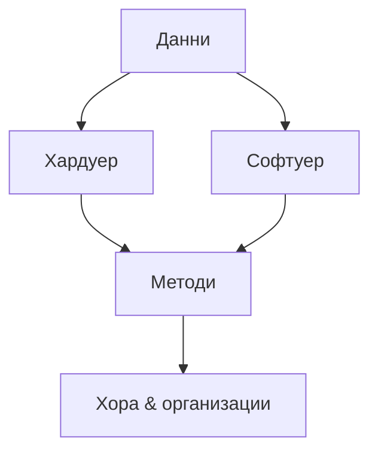

# Геоинформатика и геоинформационни технологии

## Същност, основни направления и съвременни тенденции

> *„Everything happens somewhere.“* – Tobler’s First Law of Geography  (цит. по Longley et al., 2005)

---

### 1. Исторически поглед и дефиниции

Геоинформатиката (Geoinformatics) възниква през 1960‑те с **Canadian GIS** и концепцията за *spatial data handling* (Tomlinson). Чрез работата на NCGIA (Goodchild, Anselin) през 1980‑те се формулират „специалните свойства на пространствените данни“ — *автокорелация* и *нееднородност* citeturn?. В наши дни дисциплината обхваща **методи, алгоритми и инструменти** за събиране, управление, анализ и представяне на геопространствена информация.

> **Геоинформационни технологии (ГИТ)** са практическата реализация на тези методи чрез хардуер, софтуер, стандарти и работни потоци.

#### 1.1 Компонентен модел на ГИТ



Компонентите са взаимозависими – липсата на обучени кадри или стандартизирани работни процеси компрометира останалите звена.

---

### 2. Основни направления

| Направление                            | Ключови понятия                                                                                  | Типичен софтуер / стандарти            |
| -------------------------------------- | ------------------------------------------------------------------------------------------------ | -------------------------------------- |
| **GIS**                                | вектор/растер, topological model, overlay, network analysis                                      | ArcGIS, QGIS, GRASS, OGC SF, ISO 19107 |
| **Remote Sensing (ДЗЗ)**               | пространствена, спектрална, времева резолюция; atmospheric correction; supervised classification | ENVI, SNAP, Google Earth Engine        |
| **GNSS**                               | GPS, GLONASS, Galileo; диференциална корекция, RTK; multipath                                    | Trimble RTX, Leica Viva, RTKLIB        |
| **Геобази данни**                      | PostGIS, Oracle Spatial, NoSQL‑geospatial (MongoDB)                                              | SQL/MM, OGC Simple Features            |
| **Картография & Геовизуализация**      | визуална йерархия, симвология, управляемо генерализиране, WebGL                                  | Mapbox GL, Kepler.gl, D3.js            |
| **Уеб‑ГИС & SDI**                      | REST, GraphQL, OGC API, INSPIRE, metadata ISO 19115                                              | GeoServer, ArcGIS Enterprise           |
| **Пространствен анализ & Data Mining** | локални/глобални Moranʼs I, GWR, hotspot, ML‑clustering                                          | PySAL, scikit‑mobility, H3             |

#### 2.1 Пример: поток за класификация на сателитно изображение

```mermaid
flowchart LR
  A[Raw Sentinel‑2] --> B[Atmospheric Correction]
  B --> C[Feature Extraction (NDVI, GLCM)]
  C --> D[Training Samples]
  D --> E[Random Forest]
  E --> F[Accuracy Assessment]
```

---

### 3. Ключови концепции и добри практики

* **Данни:**

  * *Raster* vs *Vector* (Chang, 2018)
  * Spatial vs. Attribute integrity – топологични правила (Popov & Dimitrov, 2009)
* **Координатни системи:** геодезически датум (WGS 84), картни проекции (UTM, Ламберт) – избор съобразно мащаба и разтегленията (Kraak & Ormeling, 2020).
* **Метаданни и качество:** ISO 19157 “Data Quality” – пълнота, логическа съвместимост, точност.
* **Spatial ETL:** extract‑transform‑load pipelines с FME/ArcPy; валидиране и геокодиране.
* **Интероперативност:** OGC Web Map Tile Service (WMTS), OGC API‑Features.

---

### 4. Съвременни тенденции (2020‑2025)

| Тенденция                        | Движещи сили                                    | Приложения                                                          |
| -------------------------------- | ----------------------------------------------- | ------------------------------------------------------------------- |
| **Cloud & Serverless GIS**       | GEE, AWS Lambda, ArcGIS Image for ArcGIS Online | обработка на петабайти архиви, flood‑monitoring near real‑time      |
| **GeoAI**                        | CNN/Transformers, GNN’s, AutoML                 | автоматична картосъставителност, детекция на незаконно строителство |
| **Digital Twins (4D GIS)**       | CityGML 3.0, IFC, SensorThings                  | управление на интелигентна инфраструктура, what‑if симулации        |
| **Edge & IoT Geostreams**        | MQTT, 5G, TinyML                                | мониторинг на въздуха, автономни дронове                            |
| **AR/VR/XR**                     | Unity XR, HoloLens 2                            | теренни инспекции, участие на гражданите в планирането              |
| **Blockchain for Land Cadastre** | smart‑contracts, immutable ledgers              | сигурност на имотните регистри                                      |
| **Етика & GEO‑Privacy**          | GDPR, диференциална геопривативност             | анонимизация на мобилни траектории                                  |

---

### 5. Казуси от практиката (България / ЕС)

* **Наводнения Карловско 2022** – интеграция на Sentinel‑1 SAR time‑series, LiDAR DEM и дронови ортофото за бързо картографиране на заливките.
* **Винено земеделие в Тракия** – прецизно торене чрез Sentinel‑2 NDVI + RTK GNSS управление на самоходни пръскачки.
* **Smart Sofia** – реално‑времеви трафик‑dashboard с GeoEvent Server, AQ‑сензори и machine‑learning прогнозен модел.
* **Културно наследство** – лазерно сканиране + фотограметрия за 3D‑модел на Боянската църква, публикуван с Cesium JS.

---

### 6. Предизвикателства и изследователски посоки

* **Справяне с Big Spatial Data** – оптимизация на индекси (QuadTree, R‑Tree, H3) в масиви >10 TB.
* **Интердисциплинарна интеграция** – свързване на *omics* данни с пространствени слоеве (Geo‑Bioinformatics).
* **Explainable GeoAI** – интерпретируемост на DL‑класификации върху сателитни сцени.
* **Киберсигурност** – zero‑trust архитектури за SDI, криптографски подписи на геосървиси.

---

### 7. Заключение

Геоинформатиката е движеща сила за **интелигентно управление на територията**, устойчива инфраструктура и научно‑обосновани политики. Бъдещето ѝ е ориентирано към **облачни, AI‑подкрепени и хиперсвързани платформи**, но същевременно поставя остри въпроси за етика и сигурност. Доброто разбиране на концепциите и технологиите в този документ изгражда стабилна основа за професионална реализация и успешно явяване на държавния изпит.

---

### Използвани източници

* Anselin, L. (1989). *What is special about spatial data?* NCGIA Tech. Paper 89‑4.
* Chang, K. (2018). *Introduction to GIS* (9th ed.). McGraw‑Hill.
* Chuvieco, E. (2020). *Fundamentals of Satellite Remote Sensing* (3rd ed.). CRC Press.
* Heywood, I., Cornelius, S., Carver, S. (2006). *An Introduction to GIS*. Pearson.
* Kraak, M.‑J., Ormeling, F. (2020). *Cartography* (4th ed.). CRC Press.
* Longley, P., Goodchild, M. F., Maguire, D. J., Rhind, D. W. (2005). *GIS: Principles, Techniques, Management and Applications* (2nd ed.). Wiley.
* Попов, А. (2012). *ГИС – основи на геоинформационното моделиране*. Анубис.
* Попов, А., Димитров, С. (2009). *Приложение на ГИС в планирането и управлението на територията*. София.
* Сaрaфова, М. (2024). *Картография*. ISBN 978‑619‑91426‑6‑0.
