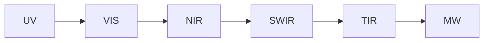

# Електромагнитна радиация и електромагнитен спектър

## Спектрални диапазони · Спектрални сигнатури · Взаимодействие с атмосферата и земната повърхност

---

### 1. Същност на електромагнитната радиация (EMR)

**Електромагнитната радиация** представлява поток от фотони, характеризиращи се с двойствен електрически и магнитен вектор, разпространяващи се във вакуум със скоростта на светлината $c = 2.998\times10^8\;\text{m·s}^{-1}$. Вълновата $\lambda$ и честотната $\nu$ природа са свързани чрез

$$
\lambda = \frac{c}{\nu},\qquad E = h\nu = \frac{hc}{\lambda}
$$

където $h$ е константата на Планк. За дистанционните изследвания параметърът **дължина на вълната** (µm) е удобен, тъй като сензорните филтри и атмосферните прозорци се дефинират в този домейн.

---

### 2. Електромагнитен спектър – структуриране

| Диапазон        | Съкратено | $\lambda$ (µm) | Енергия (eV) | Дистанционни приложения              |
| --------------- | --------- | -------------- | ------------ | ------------------------------------ |
| Озонов UV-B     | UVB       | 0.28–0.32      | 3.9–4.4      | Озонов мониторинг (OMI)              |
| Видима светлина | VIS       | 0.4–0.7        | 1.8–3.1      | Базова картография, RGB визуализация |
| Близък ИЧ       | NIR       | 0.7–1.3        | 0.95–1.8     | Вегетация (NDVI), биомаса            |
| Кратък ИЧ       | SWIR      | 1.3–3.0        | 0.4–0.95     | Минералогия, влажност на почвата     |
| Среден ИЧ       | MWIR      | 3.0–8.0        | 0.15–0.4     | Горещи точки, активни пожари         |
| Термичен ИЧ     | TIR       | 8.0–14         | 0.09–0.15    | Температура на повърхността (LST)    |
| Микровълни      | MW        | 0.01–1000 мм   | 10⁻⁴–10⁻⁸    | SAR, пасивна радиометрия, GNSS‑R     |

*Енергийните стойности са приблизителни, изчислени при централната $\lambda$ на диапазона.*



---

### 3. Спектрални сигнатури

Спектралната сигнатура е **характерна зависимост на отражателната или емисивната способност** от $\lambda$ за даден материал. Разликите позволяват тематично картографиране.

#### 3.1 Характерни подписи

| Материал                | Ключови особености                                                                                            |
| ----------------------- | ------------------------------------------------------------------------------------------------------------- |
| **Здравa растителност** | Зелено „червен ръб“: резък скок между 0.68 и 0.75 µm; високо NIR (\~40–60 %), водни абсорбции при 1.4, 1.9 µm |
| **Вода**                | Ниска VIS (3–10 %), почти нулево > 0.8 µm; TIR емисивност висока (ε≈0.98)                                     |
| **Суха почва**          | Линейно нарастваща рефлектантност с $\lambda$; минералогични абсорбции при 2.2 µm (хидроксили)                |
| **Сняг лед**            | Висока VIS, пада рязко в SWIR (> 1.5 µm); затова NDSI използва 0.56/1.6 µm                                    |


---

### 4. Взаимодействие EMR – атмосфера

#### 4.1 Разсейване

* **Рейли ($d \ll \lambda$)** – $I \propto \lambda^{-4}$; обяснява синьото небе.
* **Ми ($d \approx \lambda$)** – аерозоли, димен облак.
* **Не‑селективно** – $d \gg \lambda$; водни капки, облаци ➜ бяло отражение.

#### 4.2 Поглъщане

Основни абсорбери и ленти:

* O₃: 0.26–0.3 µm (UV‑B).
* H₂O: 0.94 µm, 1.14 µm, 1.4 µm, 1.9 µm, > 6 µm.
* CO₂: 1.43 µm, 2.05 µm, 15 µm.

##### Атмосферни прозорци

| Прозорец | Диапазон (µm) | Сензорни ленти                           |
| -------- | ------------- | ---------------------------------------- |
| VIS‑NIR  | 0.4–1.1       | Landsat‑8 (band 2–5), Sentinel‑2 (B2–B8) |
| SWIR     | 1.55–1.75     | Landsat‑8 B6, Sentinel‑2 B11             |
| TIR      | 10.4–12.5     | Landsat‑9 TIRS B10/B11                   |
| MW       | 3–30 cm       | Sentinel‑1 C‑band, ALOS-2 L‑band         |

#### 4.3 Атмосферна корекция

* **Радиативни трансферни модели** – *6S*, *MODTRAN*; вход H₂O, O₃, AOD.
* **Емпирични** – Dark Object Subtraction (DOS), Empirical Line Calibration (ELC).

---

### 5. Взаимодействие EMR – земна повърхност

Вълната достига обекта ➜ разделя се на компоненти **ρ** (отразена), **α** (погълната), **τ** (пропусната):

$$
ρ(\lambda)+α(\lambda)+τ(\lambda)=1
$$

* **Диелектрични свойства** – влияят върху микровълнови отражения (почвена влага ↑ ➜ εʹ ↑).
* **Геометрия и грапавост** – ламбертови (дифузни) vs огледални (спекуларни) повърхнини.
* **Температура** – за TIR: $L_ε(\lambda,T) = ε \cdot B(\lambda,T)$, Закон на Планк.

---

### 6. Избор на сензорни ленти според взаимодействие

| Цел                     | Индекс/Метод | Ленти (µm)  | Физична основа                      |
| ----------------------- | ------------ | ----------- | ----------------------------------- |
| **Вегетационен индекс** | NDVI         | 0.66 / 0.86 | Хлорофил абсорбция + NIR отражение  |
| **Сняг/лед**            | NDSI         | 0.56 / 1.6  | Сняг погл. SWIR                     |
| **Гори‑пожари**         | NBR          | 0.86 / 2.2  | Изгорели площи ↓ NIR, ↑ SWIR        |
| **Температура**         | LST          | 10.9 / 12.0 | ТIR емисивност, split‑window        |
| **Почвена влага (MW)**  | σ⁰ VH        | 5.6 cm      | Влага ↑ ➜ диелектрично ↑ ➜ сцатер ↑ |

---

### 7. Практически пример – Spectral signature extraction (Python)

```python
import rasterio, numpy as np
from spectral import open_image

img = open_image('LC09_L2SP_184030_20240615_MTL.hdr')
water = img[50:100, 100:150, :]
veg   = img[200:250, 400:450, :]
water_sig = water.mean(axis=(0,1))
veg_sig = veg.mean(axis=(0,1))
```

*Генерира средни подписи за вода и растителност ➜ визуализация във matplotlib (NIR plateau на veg, нисък NIR на water).*

---

### 8. Заключение

Разбирането на пълния **електромагнитен континуум**, характерните **спектрални подписи** и механизмите на **взаимодействие с атмосферата и повърхността** е фундаментално за всяко приложение на дистанционните изследвания. Точно подбраните сензорни ленти, корекции и индекси извличат максимална тематична информация от суровите цифрови стойности.

---

### Използвани източници

1. Chuvieco, E. (2020). *Fundamentals of Satellite Remote Sensing* (3rd ed.). CRC Press.
2. Lillesand, T., Kiefer, R. W., & Chipman, J. (2015). *Remote Sensing and Image Interpretation* (7th ed.). Wiley.
3. Sabins, F. F., & Ellis, J. M. (2020). *Remote Sensing: Principles and Interpretation* (4th ed.). Waveland.
4. Green, K., Congalton, R. G., & Tukman, M. (2017). *Imagery and GIS*. ESRI Press.
5. ESA (2024). *Sentinel‑2 MSI: Technical Guide*.
6. NASA (2025). *Hyperspectral Imaging Science Whitepaper*.
