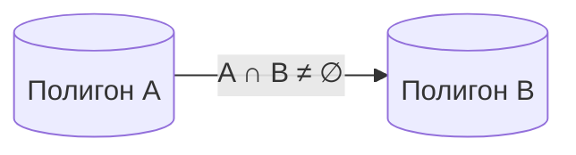
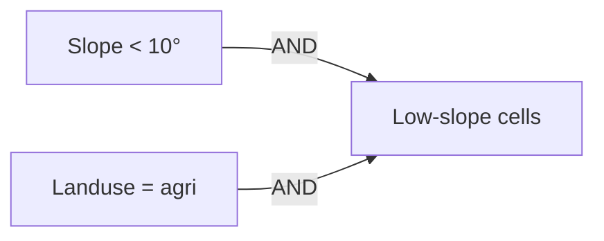
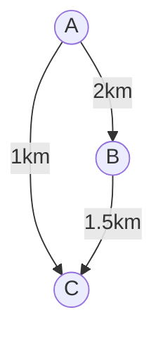
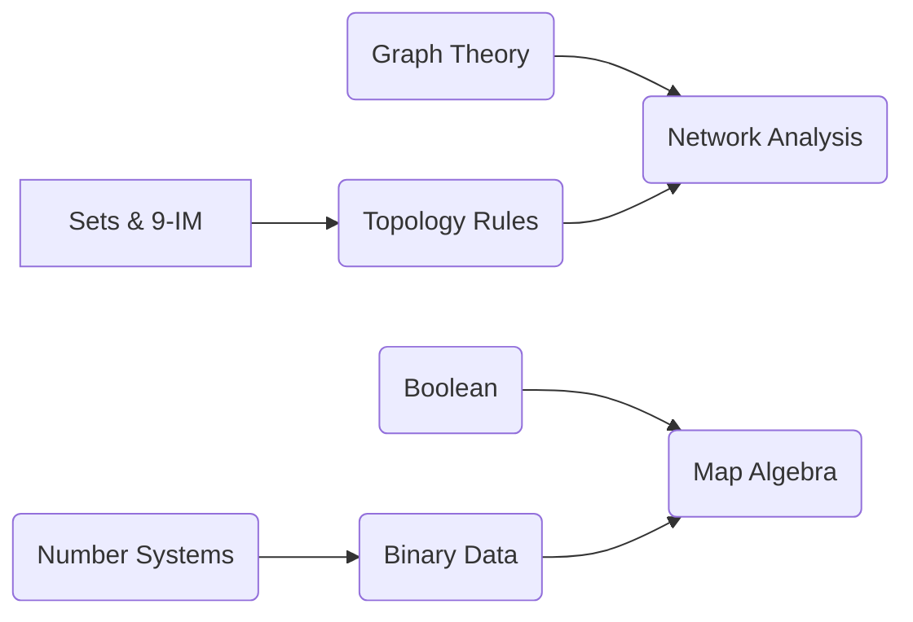

# Математически и логически основи на геоинформатиката

## Множества · Бройни системи · Булева алгебра · Теория на графите

---

### 1. Защо са нужни „сухи“ математика и логика в ГИС?

Геоинформатиката работи с **структурирани** и **семантични** пространствени данни. Затова всяка операция – от валидиране на топология до намиране на най-къс път – опира до формални математически понятия.

> **Ключова идея:** *„Ако можеш да го дефинираш с множества и логически правила, можеш да го моделираш в ГИС.“*

На следващите страници ще разгледаме четири стълба, без които съвременните геоинформационни технологии (ГИТ) не биха съществували.

---

### 2. Теория на множествата

| Понятие                            | GIS-аналог                                                        |
| ---------------------------------- | ----------------------------------------------------------------- |
| **Множество (Set)**                | Колекция от обекти (features) – напр. всички реки в басейна       |
| **Елемент (Element)**              | Конкретен обект – р. Искър                                        |
| **Подмножество (Subset)**          | Реки със среден дебит > 100 m³/s                                  |
| **Обединение (Union)** $A ∪ B$     | `Union` операция в ArcGIS за сливане на две полигона              |
| **Сечение (Intersection)** $A ∩ B$ | `Intersect` – общата част между ЗЗП и горски фонд                 |
| **Разлика (Difference)** $A — B$   | `Erase` – изключване на населените места от зона 100 m около реки |

#### 2.1 Топологични отношения – 9‑Intersection Model

Топологията в GIS използва матрица на **Егенхофер (Egenhofer)**, произтичаща от теорията на множествата, за да определи дали два полигона *се пресичат*, *съдържат* или *се допират*.

#### 2.2 Отворени и затворени множества в пространството

* **Отворени** (open sets): зони без граница – използват се при буфериране, когато границата е изключена.
* **Затворени** (closed sets): включват периметъра – важни за коректно изчертаване на катастрални имоти.

---

### 3. Бройни системи

Геопространствените данни са дигитални; познаването на бройни системи е критично за **CAD/GIS формати**, **битови дълбочини** и **компресия**.

| Система               | Основа | Примерно приложение                                         |
| --------------------- | ------ | ----------------------------------------------------------- |
| Двоична (Binary)      | 2      | Растерни стойности (0/1 при маски), флагове “valid/invalid” |
| Осмична (Octal)       | 8      | UNIX права на shapefiles при сървъри                        |
| Шестнадесетична (Hex) | 16     | RGBA цветове в WebGIS (`#FF4500`), WKB геометрия            |
| Десетична (Decimal)   | 10     | Четими координати, атрибути                                 |

#### 3.1 Битова дълбочина и динамичен обхват

* **8‑bit** (0‑255): индексирани цветови палитри, land‑cover класации.
* **16‑bit signed/unsigned**: сателитни сурови DN (Digital Number) стойности – Sentinel‑2 (`0 – 10000`).
* **32‑bit float**: DEM височини и вероятностни слоеве.

> **Забележка:** Неправилен избор на битова дълбочина води до *clipping* и загуба на информация (Lillesand et al., 2015).

---

### 4. Булева алгебра (Boolean Algebra)

Булевите оператори **AND, OR, NOT, XOR** лежат в основата на **map algebra** (Tomlin, 1990) – езика, с който комбинираме растерни слоеве.

| Оператор | Символ | ArcPy/Raster Calculator пример              |                        |
| -------- | ------ | ------------------------------------------- | ---------------------- |
| AND      | `∧`    | `(Slope < 10) & (Landuse == "agriculture")` |                        |
| OR       | `∨`    | \`(Soil == "chernozem")                     | (Soil == "cambisol")\` |
| NOT      | `¬`    | `~(FloodRisk > 0.7)`                        |                        |
| XOR      | `⊕`    | `Raster("forest") ^ Raster("protected")`    |                        |

#### 4.1 Истина‑таблици

Булевите оператори могат да се представят чрез **истина‑таблица**; това позволява оптимизация на сложни SQL‑филтри и Spatial Index търсения.

---

### 5. Теория на графите

Графите $G = (V, E)$ моделират **мрежови** структури:

* **Пътни и транспортни мрежи** – routable graphs, turn restrictions (OSM).
* **Хидрографска мрежа** – *directed acyclic graph* (DAG) от притоци.
* **Електропреносни мрежи** – анализ на надеждност и уязвимости.

#### 5.1 Видове графи

| Тип                         | Свойства                        | GIS‑пример                          |
| --------------------------- | ------------------------------- | ----------------------------------- |
| Насочен (Directed)          | ребрата имат ориентация         | Речна мрежа (поточност)             |
| Ненасочен (Undirected)      | двустранно движение             | Пешеходна пътека                    |
| Вземан‑насочен (Bidirected) | различни ограничения по посоки  | Път еднопосочен + велосипедна лента |
| Претеглен (Weighted)        | тегло = дължина, време, CO₂     | „Най‑бърз маршрут“                  |
| Мулти‑граф                  | няколко ребра между две върхове | Паралелни улици                     |

#### 5.2 Класически алгоритми и тяхното GIS прилагане

| Алгоритъм          | Сложност          | Функция                  | Приложение                            |
| ------------------ | ----------------- | ------------------------ | ------------------------------------- |
| **Dijkstra**       | $O(E \log V)$     | най‑къс път              | Карти за навигация                    |
| **A**\*            | $O(E)$ приближена | х‑евристика              | 3D‑пътен анализ в планински терен     |
| **Kruskal / Prim** | MST               | минимален свързващ дърво | Оптимално свързване на сензорна мрежа |
| **PageRank**       | $O(E \log V)$     | мерки за централност     | Оптимизация на споделени велосипеди   |

*Претеглен граф: ръбовете съдържат разстояние; Dijkstra намира A→B най‑кратък (1+1.5=2.5 km) спрямо директния 2 km?* (пример за илюстрация на избора на маршрут спрямо ограничения).

---

### 6. Взаимовръзка между четирите стълба в ГИС‑живота

* **Топология** (Sets) дефинира валидни свързвания → **Graph** анализ.
* **Булева алгебра** използва **Binary** представяне за бързи растерни операции.

---

### 7. Практически примери в софтуер

* **ArcPy** – `arcpy.sa.Con` използва булеви изрази за условни растери.
* **PostGIS** – `ST_Relate` реализира 9‑IM чрез битов шаблон.
* **pgRouting** – `pgr_dijkstra` прилага алгоритъма върху PostGIS граф.
* **QGIS Field Calculator** – експресии в двоично/шестнадесетично за RGB разкомпресия.

---

### 8. Заключение

Математическите и логическите основи осигуряват **формална коректност**, **ефикасност** и **възпроизводимост** на пространствените анализи. Зад всяка привидно „визуална“ операция в ГИС стои ясно определен алгоритъм, описуем чрез множества, логически операции или графи. Затова доброто им разбиране е задължително условие за успешна реализация в сферата.

---

### Използвани източници

1. Chang, K. (2018). *Introduction to GIS* (9th ed.). McGraw‑Hill.
2. Heywood, I., Cornelius, S., Carver, S. (2006). *An Introduction to GIS*. Pearson.
3. Longley, P., Goodchild, M. F., Maguire, D. J., Rhind, D. W. (2005). *GIS: Principles, Techniques, Management and Applications*. Wiley.
4. McGrew, C., & Monroe, Ch. (2014). *An Introduction to Statistical Problem Solving in Geography*. Waveland.
5. Taylor, P. (2018). *Quantitative Methods in Geography*. CRC Press.
6. Попов, А. (2012). *ГИС – основи на геоинформационното моделиране*. Анубис.
7. Lillesand, T., Kiefer, R. W., & Chipman, J. (2015). *Remote Sensing and Image Interpretation*. Wiley.
