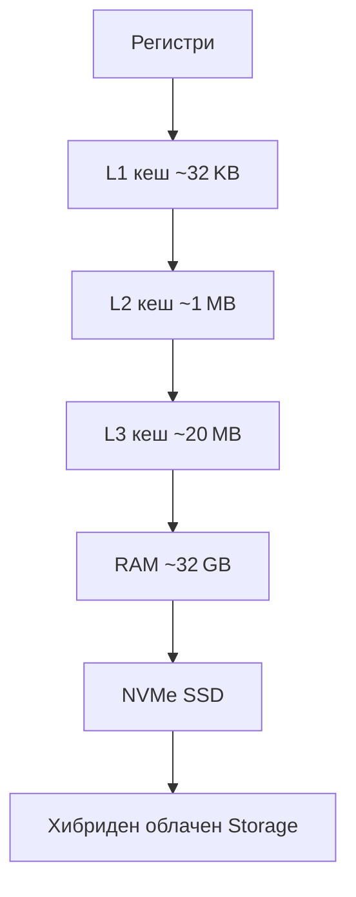
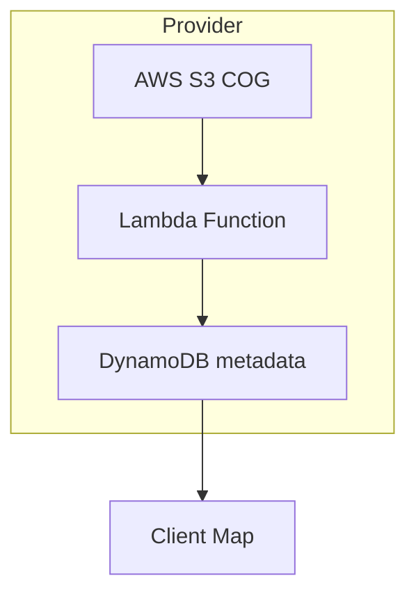

# Компютърни основи на геоинформатиката

## Хардуер · Софтуер · Мрежи · Облаци · DevOps

---

### 1. Защо компютърните основи са критични?

Съвременните геоинформационни системи (GIS) обработват \**терабайти* сателитни снимки, милиарди векторни обекти и потоци от IoT‑сензори в реално време. За да доставят резултат за секунди, са нужни оптимизирани слоеве хардуер, операционни системи, мрежи и софтуерни архитектури. Познаването им позволява да направим правилни избори за *performance*, *scalability* и *cost*.

> **Ключова идея:** Архитектурата „данни → изчисление → представяне“ се реализира чрез последователни компютърни нива – от транзистора до облачната функция.

---

### 2. Компютърна архитектура

#### 2.1 CPU, GPU и паралелизъм

* **CPU (Central Processing Unit)** – общо предназначение, силен при сложни условни оператори (spatial join, SQL).
* **GPU (Graphics Processing Unit)** – хиляди ядра за *SIMD*‑операции, идеално за растерна конволюция, CNN‑класификации (CUDA, OpenCL).
* **GPGPU в геоинформатиката:** библиотеката *CuSpatial* ускорява `point‑in‑polygon` с два реда Python.

#### 2.2 Паметна йерархия

* **Локалност на данните** – ефективните алгоритми минимизират обръщенията към бавни нива (I/O‑bounded).
* *Chunking* в `xarray`/`dask` разделя NetCDF на **tiling** пакети, които „поберат“ в кеша.

---

### 3. Системи за съхранение на пространствени данни

| Ниво              | Технология     | Характеристики                         | Типични ГИС‑файлове |
| ----------------- | -------------- | -------------------------------------- | ------------------- |
| **Локално**       | NVMe, RAID‑5   | IOPS > 700k, паралелен read            | GeoTIFF, Shapefile  |
| **Мрежово (NAS)** | NFS, SMB       | централизирано, лесно споделяне        | File Geodatabase    |
| **Разпределено**  | HDFS, Ceph     | петабайти, репликация                  | COG, Parquet        |
| **Облачно**       | S3, Azure Blob | „безкрайно“ скелируемо, tiered storage | STAC assets         |

* **Cloud Optimized GeoTIFF (COG)** – георастер, организиран за HTTP Range GET; избягва пълно изтегляне.
* **GeoParquet** – колоночна отворена алтернатива на Shapefile + тип `geometry`.

---

### 4. Операционни системи и виртуализация

| OS                         | Предимства за ГИС                        | Недостатъци                           |
| -------------------------- | ---------------------------------------- | ------------------------------------- |
| **Linux (Ubuntu, CentOS)** | GDAL от пакет мениджъра; Docker native   | Крива на учене за desktop потребители |
| **Windows**                | ArcGIS Pro, ArcPy, MS SQL Server Spatial | Лицензи, по‑тежък Docker toolbox      |
| **macOS**                  | QGIS, Homebrew GDAL                      | Ограничена ESRI‑екосистема            |

* **Контейнери (Docker)** – „опаковане“ на GDAL + Python + собствени скриптове → портируеми обработки.
* **Kubernetes** – оркестрира стотици контейнери за *tile rendering* и *real‑time* API – напр. MapTiler Cloud.

---

### 5. Мрежови и уеб технологии

#### 5.1 TCP/IP и HTTP

* **Портове 80/443** – стандартни за OGC services; `HTTPS` осигурява TLS шифроване.
* **WebSockets & MQTT** – ниска латентност за потокови сензори (AQ, traffic).

#### 5.2 OGC и „web‑native“ стандарти

| Услуга               | Протокол      | Данни           | Пример                           |
| -------------------- | ------------- | --------------- | -------------------------------- |
| **WMS**              | HTTP GET/POST | растер PNG/JPEG | `GetMap` за фонова карта         |
| **WFS**              | GML/GeoJSON   | вектор          | `GetFeature` за парцели          |
| **WMTS**             | tile matrix   | тайл плочки     | OpenStreetMap                    |
| **OGC API‑Features** | REST + JSON   | вектор          | `https://demo.ldproxy.net/daraa` |

---

### 6. Програмиране и скриптинг

| Език / Библиотека                      | Сфера           | Пример                    |
| -------------------------------------- | --------------- | ------------------------- |
| **Python** – GDAL, rasterio, geopandas | ETL, анализ     | `gpd.overlay()`           |
| **JavaScript** – Leaflet, Mapbox GL    | Web GIS         | `L.geoJSON()`             |
| **C/C++** – GEOS, PROJ                 | ядро на GDAL    | TOP‑performance buffering |
| **SQL** – PostGIS                      | сървърна логика | `ST_ClusterDBSCAN`        |

* **Jupyter Notebooks** + `ipyleaflet` = интерактивни тетрадки за обучение и бърз прототип.

---

### 7. Системи за управление на бази данни (DBMS)

| Тип            | Продукт                | Геопространствени инструменти     |
| -------------- | ---------------------- | --------------------------------- |
| **Релационен** | PostgreSQL/PostGIS     | `geometry`, GIST, `ST_Intersects` |
| **Колонен**    | ClickHouse             | `latitude/longitude` index        |
| **NoSQL**      | MongoDB, ElasticSearch | `2dsphere`, `geo_bounding_box`    |
| **Графов**     | Neo4j + PostGIS FDW    | `Spatial Cypher`                  |

> **Spatial index:** R‑Tree (2D), Quad‑Tree (tiled), H3 (hex‑grids) – ключ за <100 ms заявки.

---

### 8. Облачни изчисления и Big Data

* **Serverless (FaaS)** – плати‑само‑когато‑изпълняваш; идеално за *on‑demand* растерни изрязвания.
* **Spark + GeoMesa/GeoSpark** – обработва милиарди точки (GPS), кластеризация, heat maps.
* **Google Earth Engine (GEE)** – SaaS, над 40 PB архив облагиранѝ изображения с JavaScript API.

---

### 9. DevOps и CI/CD в геоинформатиката

| Стъпка              | Инструмент           | Задача                                 |
| ------------------- | -------------------- | -------------------------------------- |
| **Version control** | git, GitHub, GitLab  | код, конфигурации, GeoPackage          |
| **CI**              | GitHub Actions       | `pytest` + `flake8` на ArcPy‑скриптове |
| **CD**              | Argo CD, Helm        | деплой на GeoServer stack              |
| **Monitoring**      | Prometheus + Grafana | тайл кеш пропускателна способност      |

---

### 10. Формати, стандарти и интероперативност

| Категория          | Формати                                    | Бележки                             |
| ------------------ | ------------------------------------------ | ----------------------------------- |
| **Вектор**         | Shapefile, GeoJSON, GeoPackage, FlatGeobuf | FGb – streamable, индекс в header   |
| **Растер**         | GeoTIFF/COG, NetCDF, HDF5, Zarr            | `chunked+compressed` cloud friendly |
| **Мрежови услуги** | WMTS, XYZ‑tiles, MVT (vector tiles)        | MVT = protobuf, Картен стил отделно |
| **Метаданни**      | ISO 19115, Dublin Core, STAC               | STAC Item с COG Asset               |

---

### 11. Казус: NDVI – локален HPC срещу Google Earth Engine

| Етап          | HPC (Slurm cluster 48 cores) | GEE (cloud)            |
| ------------- | ---------------------------- | ---------------------- |
| Setup         | Docker + rasterio + dask     | JavaScript IDE         |
| Data pull     | 120 GB local Landsat‑8 L2    | Server‑side load       |
| Compute time  | 28 min (dask)                | < 2 min                |
| Cost          | амортизация + енергия        | \$0 (within free tier) |
| Repeatability | ansible playbook             | saved script ID        |

---

### 12. Заключение

Компютърната инфраструктура е „невидимият гръбнак“ на геоинформатиката. Знанието **как** да изберем подходящ хардуер, **къде** да разположим данните и **с какви** инструменти да автоматизираме разгръщането, прави разлика между проект, който се срива под натоварване, и такъв, който осигурява навременна, точна и достоверна геоинформация.

---

### Използвани източници

1. Chang, K. (2018). *Introduction to GIS* (9th ed.). McGraw‑Hill.
2. Heywood, I., Cornelius, S., & Carver, S. (2006). *An Introduction to GIS*. Pearson.
3. Popov, A. (2012). *ГИС – основи на геоинформационното моделиране*. Анубис.
4. Longley, P., Goodchild, M. F., Maguire, D. J., & Rhind, D. W. (2005). *GIS: Principles, Techniques, Management and Applications*. Wiley.
5. Green, K., Congalton, R. G., & Tukman, M. (2017). *Imagery and GIS: Best Practices for Extracting Information from Imagery*. ESRI Press.
6. Kraak, M.‑J., & Ormeling, F. (2020). *Cartography: Visualization of Geospatial Data* (4th ed.). CRC Press.
7. Taylor, P. (2018). *Quantitative Methods in Geography*. CRC Press.
8. Lillesand, T., Kiefer, R. W., & Chipman, J. (2015). *Remote Sensing and Image Interpretation* (7th ed.). Wiley.
9. Официална документация на OGC: *Standards and Best Practices* (2025).
