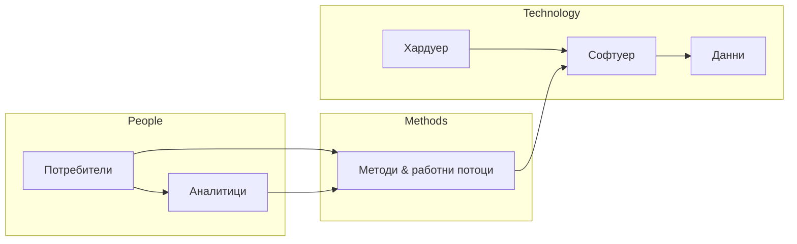
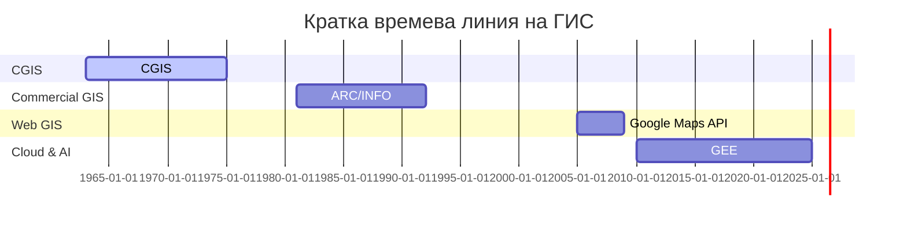

# Същност на Географските информационни системи (ГИС)

## Определение · Компоненти · Историческо развитие

---

### 1. Въведение и дефиниции

Географската информационна система (GIS) е **информационна система, проектирана да събира, съхранява, анализира и визуализира данни, обвързани с местоположение** (Longley et al., 2005). Преобразувайки въпроса *„Къде е…?“* в *„Какво значи, че е точно там?“*, ГИС превръща пространствените зависимости в actionable knowledge.

| Източник           | Ключови елементи в дефиницията                                                          |
| ------------------ | --------------------------------------------------------------------------------------- |
| *ESRI (2023)*      | Хардуер, софтуер, данни; улавяне, управление, анализ, визуализация; решение на проблеми |
| *Goodchild (2006)* | Компютърно базиран набор от инструменти за работа с данни, отнасящи се за Земята        |
| *Popov (2012)*     | Интегрирана технология за моделиране на околната среда чрез пространствени бази данни   |

> **Обща нишка:** *интеграция* на данни, алгоритми и визуални средства, фокусирана върху пространствената измеримост.

---

### 2. Фундаментални компоненти на ГИС

1. **Данни** – векторни, растерни, таблични; източници: GNSS, ДЗЗ, IoT.
2. **Софтуер** – настолен (ArcGIS Pro, QGIS), сървърен (GeoServer), облачен (GEE).
3. **Хардуер** – работни станции, GPU‑клъстери, облачни услуги.
4. **Хора** – анализатори, администратори, крайните потребители.
5. **Методи/процедури** – стандарти (OGC, ISO 191xx), добри практики, ETL пайплайни.

> **Баланс:** липсата на обучени кадри или качествени данни компрометира останалите компоненти.

---

### 3. Жизнен цикъл на геоданните в ГИС

1. **Събиране** – GNSS заснемане, краудсорс, сателит.
2. **Предварителна обработка** – QA/QC, reprojection, cleaning.
3. **Съхранение** – геобази данни (PostGIS, GeoPackage).
4. **Анализ** – overlay, network analysis, GeoAI.
5. **Визуализация** – статични карти, уеб‑дашборди, 3D сцени.
6. **Обратна връзка** – корекции на данните, нови хипотези.

---

### 4. Историческо развитие

| Етап                      | Период    | Ключови постижения                                                                       |
| ------------------------- | --------- | ---------------------------------------------------------------------------------------- |
| **Пионерски**             | 1963‑1975 | *Canadian GIS* (CGIS); SYMAP; първите топологични векторни структури (Harvard Lab)       |
| **Комерсиализация**       | 1976‑1989 | ESRI ARC/INFO; GRASS GIS (US Army CERL); стандартизирани растерни формати                |
| **Десктоп & OGC**         | 1990‑1999 | ArcView 3.x, MapInfo; OGC създава WMS/WFS; появява се PostGIS (1998)                     |
| **Уеб и Open Source**     | 2000‑2009 | OpenLayers, GeoServer; Google Maps API „демократизира“ уеб‑картите                       |
| **Мобилност и Облак**     | 2010‑2019 | ArcGIS Online, QGIS 3, Mapbox; Cloud GIS, SensorThings, GeoJSON като „лингва франка“     |
| **GeoAI & Digital Twins** | 2020‑днес | Дълбоко обучение за обекти (YOLOv8‑geospatial); CityGML 3.0; 4D‑GIS, realtime dashboards |

---

### 5. Роля на ГИС днес

* **Устойчиво развитие** – SDG индикатори (UN SDG 15 Life on Land).
* **Умни градове** – транспортни модели, енергийна ефективност.
* **Климатична наука** – анализ на тенденции в времевите серии (ESGF климатични кубове).
* **Бизнес анализ** – геомаркетинг, location intelligence.

---

### 6. Заключение

ГИС е едновременно **технология и наука**. Нейното еволюционно развитие – от големите мейнфрейми на 1960‑те до безсървърните облачни функции – отразява непрекъснатия стремеж към по‑точно, по‑бързо и по‑интерактивно разбиране на пространствения контекст. Познаването на компонентите и историческите етапи предоставя здрава концептуална рамка за всяко бъдещо специализирано приложение.

---

### Използвани източници

1. Longley, P., Goodchild, M. F., Maguire, D. J., & Rhind, D. W. (2005). *Geographical Information Systems: Principles, Techniques, Management and Applications* (2nd ed.). Wiley.
2. Popov, A. (2012). *Географски информационни системи – основи на геоинформационното моделиране*. Анубис.
3. Heywood, I., Cornelius, S., & Carver, S. (2006). *An Introduction to GIS*. Pearson.
4. ESRI. (2023). "What is GIS?" *ArcGIS Help Online*.
5. Goodchild, M. F. (2006). "GIS and Geography: The Last Forty Years." *Annals of GIS*.
6. OGC (2025). *Standards and Best Practices*.
