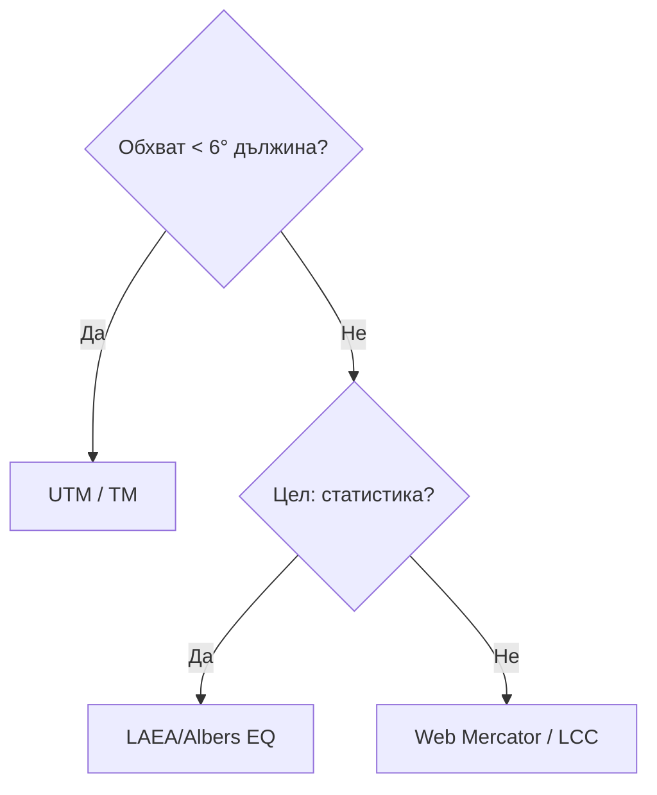

# Пространствени референтни системи (CRS)

## Референтни повърхнини · Датуми · Картографски проекции

---

### 1. Защо CRS са критични?

Всяка геометрия – точка, линия или пиксел – **има смисъл само спрямо система от координати**. Грешен CRS води до стотици метри отместване, неуспешни spatial join‑ове и погрешни анализи. Стандартът ISO 19111 дефинира „coordinate reference system“ като *правила за свързване на координати с реалния свят*.

> **Ключова идея:** *Повърхнина → Датум → CRS → Проекция* – четиристъпален път от физическата Земя до двумерната карта.

---

### 2. Референтни повърхнини

| Повърхнина             | Описание                                                                  | Формула                                             |
| ---------------------- | ------------------------------------------------------------------------- | --------------------------------------------------- |
| **Геоид**              | Физична повърхност на равно гравитационен потенциал (MSS) – „морско ниво“ | Няма проста аналитична форма                        |
| **Елипсоид (Сфероид)** | Математическо приближение на геоида чрез револвентен елипсоид             | $\frac{x^2}{a^2}+\frac{y^2}{a^2}+\frac{z^2}{b^2}=1$ |
| **Сфера**              | Специален случай a = b                                                    | $x^2+y^2+z^2=r^2$                                   |

*Ключови параметри: полу‑голяма ос $a$, сплеснатост $f=(a-b)/a$.* **GRS80**: a = 6 378 137 m; f = 1/298.257222101.

---

### 3. Геодезически датуми

Датумът „закотвя“ елипсоида в реалния свят чрез **начална точка, ориентация и мащаб**.

| Тип           | Пример             | Цел                                 | Трансформация към WGS 84                     |
| ------------- | ------------------ | ----------------------------------- | -------------------------------------------- |
| **Локален**   | Pulkovo 42 / SK‑42 | Оптимално пасва за Източна Европа   | ΔX = 23 m, ΔY = –140 m, ΔZ = –92 m (Helmert) |
| **Глобален**  | WGS 84 (EPSG:4326) | Сателитна навигация, глобални карти | Референция ITRF2020, epoch‑коригиран         |
| **Динамичен** | ITRF2014, ETRF2000 | Времева еволюция (плочови движения) | 7‑параметрова + velocity field               |

> **България:** `BGS2005` (EPSG:7801) – локална реализация на ETRS89 за дата 2005.0, заменя SK‑42.

#### 3.1 Трансформации

* **Бурса‑Волф (7‑параметров Helmert):** $ΔX,ΔY,ΔZ, R_x,R_y,R_z, S$ – точност \~1–2 m.
* **Grid‑shift (NTv2, OSTN15):** решетка от корекции; точност < 10 cm.
* **Time‑dependent (IFC):** $X_t=X_0+V_xt$ – важна след 2025 г. за динамични датумни системи.

---

### 4. Картографски проекции

Проекция = $\text{CRS}_{3D}\,\rightarrow\,\text{CRS}_{2D}$

| Клас               | Подклас                                | Основна характеристика                                             | Пример CRS                       |
| ------------------ | -------------------------------------- | ------------------------------------------------------------------ | -------------------------------- |
| **Цилиндрични**    | напречни (Transverse)                  | меридиан като ос на цилиндъра                                      | UTM Zone 35N (EPSG:32635)        |
| **Конични**        | равнинно пресичаща                     | две стандартни паралели, минимизирана деформация в средните ширини | Lambert Conformal Conic (France) |
| **Азимутални**     | еквидистантни                          | запазват разстояния от центъра                                     | LAEA Europe (EPSG:3035)          |
| **Специализирани** | гномонична, синусоидална, Уеб Меркатор | Уеб визуализация; сателитни орбити                                 |                                  |

#### 4.1 Деформации

* **Tissot indicatrix** – елипсата показва изкривяване на 1° кръг.
* Запазване: *ъглово* (конформна), *площадна* (еквивалентна), *дължинна* (еквидистантна).

#### 4.2 Избор на проекция



*Ръководство по INSPIRE* препоръчва **ETRS89 / LAEA Europe (EPSG:3035)** за пан‑европейски анализи.

---

### 5. Национални CRS – България

| Период    | CRS             | Проекция         | Забележки                                  |
| --------- | --------------- | ---------------- | ------------------------------------------ |
| 1930‑44   | КС 1930         | Gauss‑Krüger, 3° | Pulkovo 1914, меридиан София               |
| 1950‑2005 | `42/83` (SK‑42) | Gauss‑Krüger, 6° | 3‑зонова схема; EPSG:2397‑2399             |
| 2005‑н.в. | BGS2005 / UTM   | UTM 34N/35N      | Legal for cadastral & EGNS; EPSG:7801/7802 |

Софтуерът **PROJ** 9.4.0 съдържа NTv2‑grid `BGS2005.gsb` за автоматична трансформация между SK‑42 и ETRS89 (точност \~5 cm).

---

### 6. Практически работен поток

```mermaid
flowchart LR
  Raw[LiDAR .las (EPSG:2398)] --> P1[Reproject → BGS2005 / UTM 35N]
  P1 --> P2[Generate DSM → GeoTIFF]
  P2 --> P3[Clip to AOI]
  P3 --> QGIS[Visualization + hillshade]
```

*Инструменти:* `las2las -epsg 7802`, `gdalwarp -s_srs EPSG:2398 -t_srs EPSG:7802`, QGIS „Reproject layer“.
*Често срещана грешка:* пропускане на **vertical datum** – LiDAR височини остават в Baltic 1977 вместо EVRF2007.

---

### 7. Съвременни тенденции

1. **WKT2:2019** – унифициран текстов формат за CRS в OGC/ISO, замества `proj4`.
2. **Dynamic Datums & Velocity Grids** – постепенен преход към 4‑D модел (x,y,z,t).
3. **Web‑native CRS Registry** – OGC „CRS‑by‑URL“: `https://www.opengis.net/def/crs/EPSG/0/4326`.
4. **High‑resolution Geoid Models** – EGG2015 (\~1 cm RMS); подобряват GNSS нивелация.
5. **Free & open NTv2 grids** – BGRa14 за Австрия, OSTN15 за UK: демократизират сантиметрови трансформации.

---

### 8. Чести проблеми и добри практики

| Проблем                     | Симптом                      | Решение                            |
| --------------------------- | ---------------------------- | ---------------------------------- |
| МесканЗапад–МОСЕН           | Изместване \~300 m E/W       | Проверка EPSG, Gauss 3° vs 6°      |
| Недефиниран vertical CRS    | Разлика във височини 0.5‑1 m | Добави `+geoidgrids` в PROJ string |
| Бъркан `EPSG:4326` с `3857` | "Смачкана“ карта в QGIS      | Задай правилен „On‑the‑fly“ рекр.  |

> **Добра практика:** винаги документирай CRS (EPSG код + версия) в метаданните ISO 19115 `referenceSystemInfo`.

---

### 9. Заключение

Пространствените референтни системи са **скелетът на геоинформационната наука**. Разбирането на взаимоотношенията между геоид, елипсоид, датум и проекция гарантира, че геоданните се подравняват **точно** и **сравнимо** в различни приложения – от кадастъра до глобалните модели на климата. В ерата на динамичните датумни рамки и cloud‑native формати умението да превключваш между CRS и да управляваш трансформациите е задължителна компетентност за всеки геоспециалист.

---

### Използвани източници

1. Anselin, L. (1989). *What is special about spatial data?* NCGIA Tech. Paper 89‑4.
2. Kraak, M.‑J., & Ormeling, F. (2020). *Cartography: Visualization of Geospatial Data* (4th ed.). CRC Press.
3. Lillesand, T., Kiefer, R. W., & Chipman, J. (2015). *Remote Sensing and Image Interpretation* (7th ed.). Wiley.
4. Popov, A. (2012). *ГИС – основи на геоинформационното моделиране*. Анубис.
5. OGC & ISO TC211. (2024). *CRS WKT2:2019 Implementation Guidance*.
6. PROJ Contributors. (2025). *PROJ 9.4.0 Documentation*.
