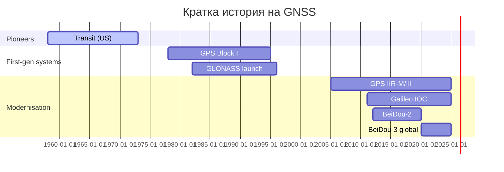

# Глобални сателитни навигационни системи (GNSS)

## Същност · Историческо развитие · Основни системи · Компоненти · Грешки и корекции

---

### 1. Какво е GNSS?

**Global Navigation Satellite System (GNSS)** е общо понятие за съзвездите от изкуствени спътници, наземна контролна инфраструктура и потребителски приемници, които осигуряват **четири‑измерна** информация: *X, Y, Z* (позиция) и *t* (време). Най‑познатото име — *GPS* — е само една от тези системи (САЩ). Съвременните устройства комбинират множество GNSS, за да повишат точността, надеждността и наличността.

> **Ключова идея:** Позиционирането разчита на едновременно измерване на разстояния до ≥4 спътника със известни efemeridi и синхронизирани часовници.

---

### 2. Историческа хронология



* **1958 – 1972** *TRANSIT* – първа оперативна спутникова навигация (фазиран доплер; точност \~20 m).
* **1973** – одобрена концепцията NAVSTAR *GPS*; пълна оперативна готовност (FOC) 1995.
* **1982‑1996** – руска *GLONASS*; възстановена в рамките 2011‑14.
* **2000** – Китай стартира *BeiDou‑1* (регионална); *BeiDou‑3* глобална на 31.07.2020.
* **2003‑2024** – Европейски *Galileo* – напълно оперативна готовност (FOC) очаквана 2026.
* Регионални допълнения: *QZSS* (Япония), *NavIC/IRNSS* (Индия).

---

### 3. Основни GNSS – сравнение

| Система           | Държава / Агенция    | Оперативни спътници         | Орбитa (MEO)       | Честоти\*            | Гражданска услуга (точност, м CEP) |
| ----------------- | -------------------- | --------------------------- | ------------------ | -------------------- | ---------------------------------- |
| **GPS** (Navstar) | САЩ / US Space Force | 31                          | 20 200 km, 55°     | L1 C/A, L2C, L5, L1C | 1.5‑3 m (SPS)                      |
| **GLONASS**       | Русия / Роскосмос    | 24                          | 19 100 km, 64.8°   | G1, G2, L3           | 2‑4 m                              |
| **Galileo**       | ЕС / ESA             | 28 (24+ сп. резерв)         | 23 222 km, 56°     | E1, E5a, E5b, E6     | 1 m (OS), < 20 cm (HAS, 2024)      |
| **BeiDou‑3**      | Китай / CNSA         | 45 (24 MEO +3 IGSO + 3 GEO) | 21 500 km, 55°     | B1C, B2a, B2b        | 1‑2 m, < 20 cm (PPP)               |
| **QZSS**          | Япония / JAXA        | 4 (цел 7)                   | Tundra‑like, 43°   | L1C/A, L2C, L5, L6   | SBAS L6 0.6 m                      |
| **NavIC**         | Индия / ISRO         | 7                           | 36 000 km GEO/IGSO | L5, S‑band           | 5 m (regional)                     |

\*Frequencies указани с гражданските сигнали; военните са опростени.

---

### 4. Архитектура на GNSS

```mermaid
graph TD
  subgraph Space Segment
    Sat[Спътници
(MEO/GEO/IGSO)]
  end
  subgraph Control Segment
    MCS[Главен контролен център] --> ULS[Upload stations]
    MCS --> MNT[Мониторинг станции]
  end
  subgraph User Segment
    Rx[Приемник]
  end
  Sat -- сигнали --> Rx
  Rx -- навигационно съобщение --> User
  Sat -- телеметрия --> MNT
  MCS -- корекции, efemeridi --> Sat
```

* **Space:** спътници с атомни часовници (CSAC, Rubidium, Hydrogen Maser).
* **Control:** глобална мрежа проследява, изчислява орбитите, синхронизира часовниците, качва навигационните послания.
* **User:** антена + RF фронтенд + ASIC/SoC за корелация, позиционно решение (PVT).

---

### 5. Източници на грешки

| Категория            | Размер (m, 1σ)                | Описание                                        |
| -------------------- | ----------------------------- | ----------------------------------------------- |
| Спътникови часовници | 1‑2                           | отклонение от GPS Time                          |
| Орбитни efemeridi    | 0.5‑2                         | несъвършено моделирани орбити                   |
| **Йоносферна**       | 5‑15                          | електронно съдържание, f‑зависимо               |
| **Тропосферна**      | 0.5‑2.5                       | температура, налягане, влажност                 |
| **Мултипът**         | 0‑1 (open sky) / 1‑30 (urban) | отражени сигнали                                |
| Шум на приемника     | 0.2‑0.5                       | термичен, квантов                               |
| Геометрия (GDOP)     | 1‑>10                         | зависима от ъгловото разположение на спътниците |

---

### 6. Методи за корекция и повишаване на точността

#### 6.1 Моделиране в приемника

* **Йоносфера:** *Klobuchar* (GPS) – 50 % ⬇ грешка; *NeQuick* (Galileo) – 70 % ⬇.
* **Тропосфера:** *Saastamoinen* / *Hopfield* модели + локални метео данни.

#### 6.2 Диференциални подходи

| Метод                               | Обхват             | Точност                                      | Изисквания                                            |
| ----------------------------------- | ------------------ | -------------------------------------------- | ----------------------------------------------------- |
| **DGPS/DGNSS**                      | 100‑300 km         | 0.5‑3 m                                      | RTCM 2.x, кодови псевдодистанции                      |
| **RTK**                             | ≤ 50 km (същински) | 1‑2 cm                                       | радио/Internet; carrier‑phase, фиксиране на амбигуити |
| **Network‑RTK (VRS, FKP)**          | до 70 km           | 1‑3 cm                                       | CORS мрежа, Ntrip caster                              |
| **PPP** (Precise Point Positioning) | глобален           | 2‑5 cm (float) / < 2 cm (ambiguity‑resolved) | точни efemeridi + часовници; конвергенция 5‑20 min    |

#### 6.3 SBAS (Satellite Based Augmentation)

| Система         | Регион            | GEO сигнали   | Точност                   |
| --------------- | ----------------- | ------------- | ------------------------- |
| **WAAS**        | Северна Америка   | L1 C/A        | 1.5 m horiz.              |
| **EGNOS v3**    | Европа (+ Африка) | L1/E1, L5/E5a | 0.6 m; сертификат LPV‑200 |
| **MSAS**        | Япония            | L1            | 2‑3 m                     |
| **GAGAN**       | Индия             | L1, L5        | 1.5‑2 m                   |
| **BDSBAS/SDCM** | Китай / Русия     | B1C, L1       | < 1 m                     |

#### 6.4 Многочестотно и мултиконстелационно решение

* Елиминира първи ред йоносферна грешка: $I_f = I_1(\lambda_1/\lambda_f)^2$.
* Намалява GDOP; средно +2‑3 доп. спътника подобряват PDOP с \~25 %.

#### 6.5 RAIM & A‑RAIM

* **Receiver Autonomous Integrity Monitoring** – статистически тест за откриване на грешни измервания; критично за авиация.
* **Advanced RAIM (ARAIM)** – използва многочестотни мултиконстелационни данни + SBAS.

---

### 7. Примерен работен поток – RTK за кадастрално заснемане

1. **Оборудване:** двучестотен GNSS‑RTK ровер + GSM модем; база = БГСГМ‑МРРБ CORS.
2. **Ntrip връзка:** `rtk.agro-gps.bg:2101`, mountpoint `BGSRTCM3_MT`.
3. **Фиксиране на амбигуити** ≤ 10 sec (здрава геометрия, PDOP < 2).
4. **Проверка:** in‑field baseline to known point ± 15 mm (2σ).
5. **Експорт:** `RINEX 3.05` + `*.jxl` за AutoCAD Map.

---

### 8. Бъдещи тенденции

1. **GPS III & Galileo IOV2** – нов сигнал *L1C* (BPSK‑10) → по‑добра urban tracking.
2. **Authentication** – *Galileo OS‑NMA*, *BeiDou B1C ACEP* за антиспуфинг.
3. **LEO PNT** – проекты *Xona Pulsar*, *Starlink Timing* (μs).
4. **Dual‑frequency смартфони** – Android raw measurements (L1+L5) → 1 m позиция.
5. **Fusion със сензори** – GNSS + 5G RTT, SLAM LiDAR → sub‑decimeter в гъст градски каньон.

---

### 9. Заключение

GNSS е фундамент на съвременните геопространствени приложения — от навигацията до точното земеделие. Познаването на **историческия контекст**, **архитектурата**, **източниците на грешки** и **коригиращите методи** позволява да се избере оптималното решение спрямо изискванията за точност, време и бюджет. В ерата на мултиконстелационните, многочестотни приемници и cloud‑базираните услуги границата между научно‑изследователски GNSS и масовия потребител продължава да се размива.

---

### Използвани източници

1. Kaplan, E. D., & Hegarty, C. (2017). *Understanding GPS/GNSS* (3rd ed.). Artech House.
2. Misra, P., & Enge, P. (2012). *Global Positioning System: Signals, Measurements, and Performance* (2nd ed.). Ganga‑Jamuna Press.
3. GNSS.europa.eu (2025). *Galileo HAS Service Definition Document v1.1*.
4. Beidou.gov.cn (2024). *BeiDou Navigation Satellite System ICD, B1C/B2a*.
5. US Space Force (2024). *GPS Interface Specification IS‑GPS‑200M*.
6. IGS (2025). *Technical Report 2024: Precise Orbits and Clocks*.
7. R. Langley (2023). "LEO Satellites for Augmenting GNSS". *GPS World*, 34(7), 20‑28.
